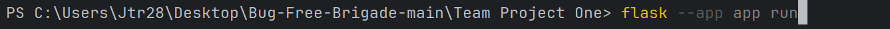
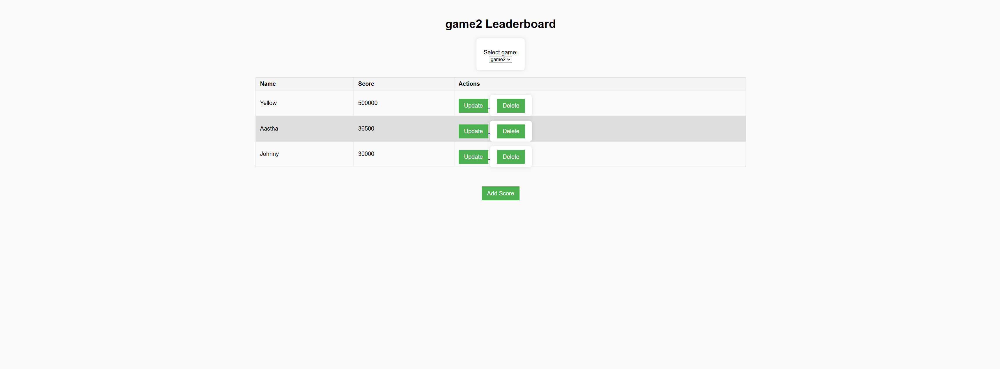
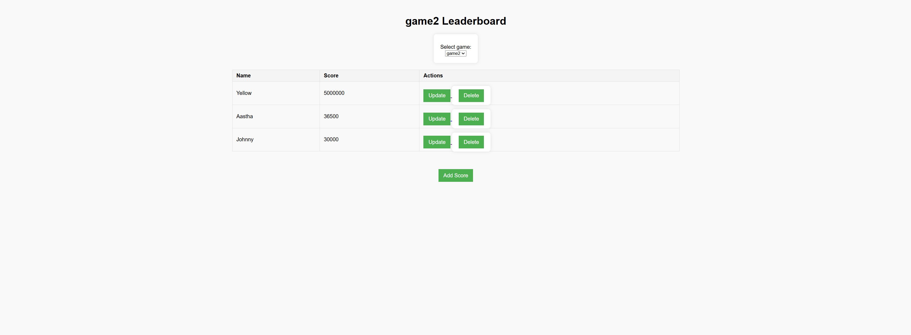
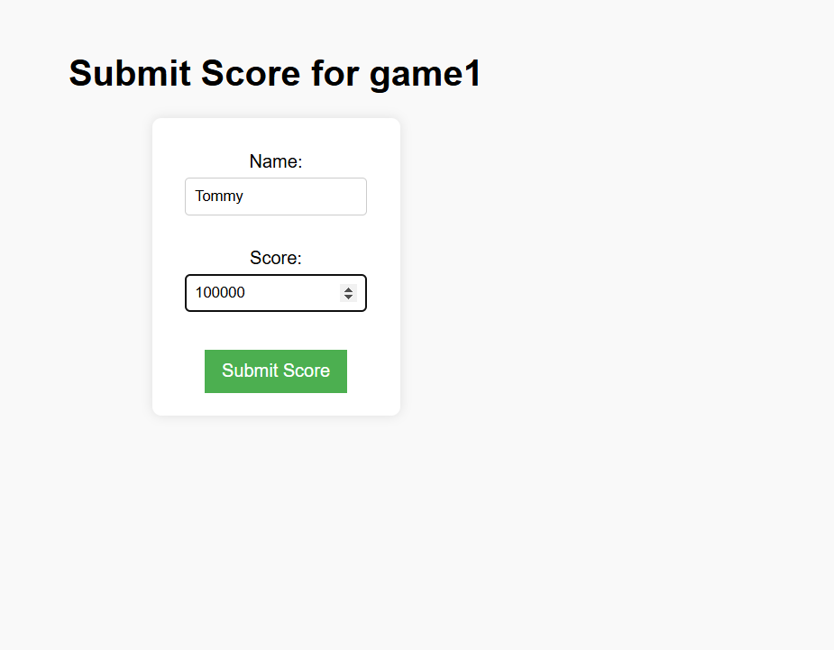
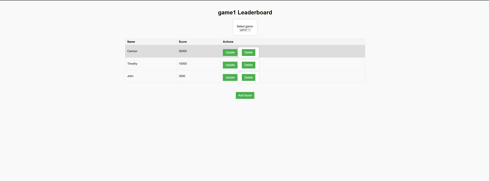
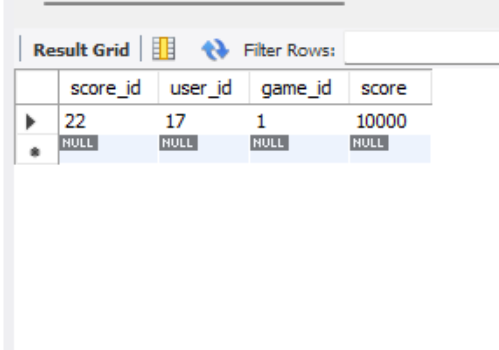
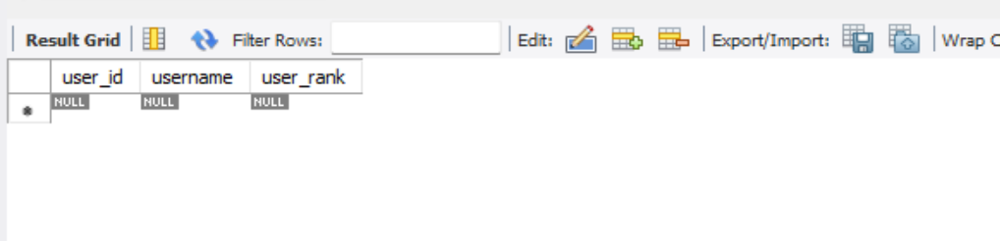
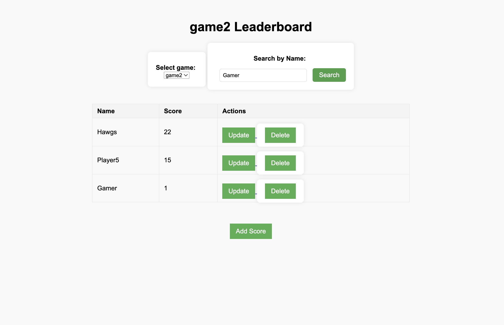
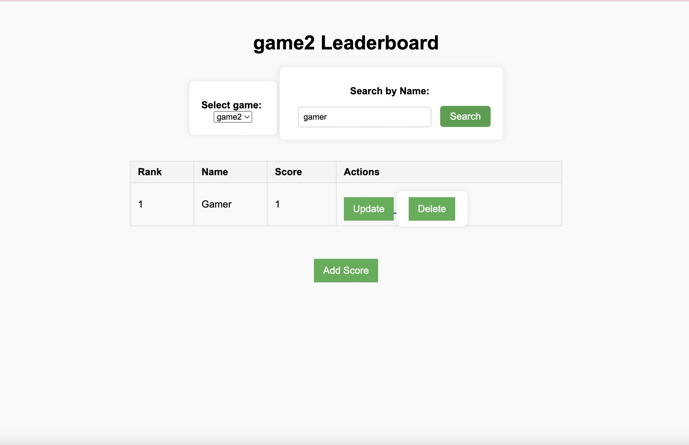

# Project: Leaderboard Tracker


## Overview

### Our Leaderboard Tracker is a Flask web app that allows users to:
- View leaderboards for multiple games.
- Submit new scores for a selected game.
- Update or delete existing scores.
- Search for players by name in a selected game.


## Setup Instructions

### Prerequisites
- Python 3.x 
- Flask (`pip install flask`) - Used to run the web server
- PyCharm IDE (optional, used by our team)


### Running the App
1. Clone or download the repository.
2. Open the `Team Project One` folder in PyCharm or your preferred IDE.
3. Open the terminal (Alt + F12 in PyCharm).
4. Run the following command:
   ```bash
   flask --app app run
   ```
5. Visit the local server address shown in your terminal (usually http://127.0.0.1:5000).


## Screenshots:




### ^ This is how we start the server


### ^ After starting the server you should see this pop up in your terminal after initating the command, Click on the website address. 


### ^ This is the website.  


### ^ Adding a score for game2.


### ^ Score being represented in game2. 


### ^ Demonstration of a score getting deleted in game2.


### ^ Action represented in the leaderboard.



### ^ Updating score for Aastha.


### ^ Score being changed.



### ^ Newly changed score being represented. 



### ^ Adding a new score to game1.


### ^ It being reflected in leaderboard. 


### ^ Deleting a score on game1.


 
### ^ Deletion being represented.


### ^ Updating a score in game1 .



### ^ Updated score being reprsented.


## Database Changes


### ^ I'm going to add a score in game1.


### ^ You can see that shawn has been correctly represented in the database. 



### ^ This shows that shawn has a user_id of 13 which was represented in users for game_id 1 which is shown in leaderboard and games and the proper score as well.


### ^ Deleting shawn from frontend



### ^ Deletion reflected in database



### ^ Using the search bar to filter players in game2



### ^ Search result showing only the player matching the name.