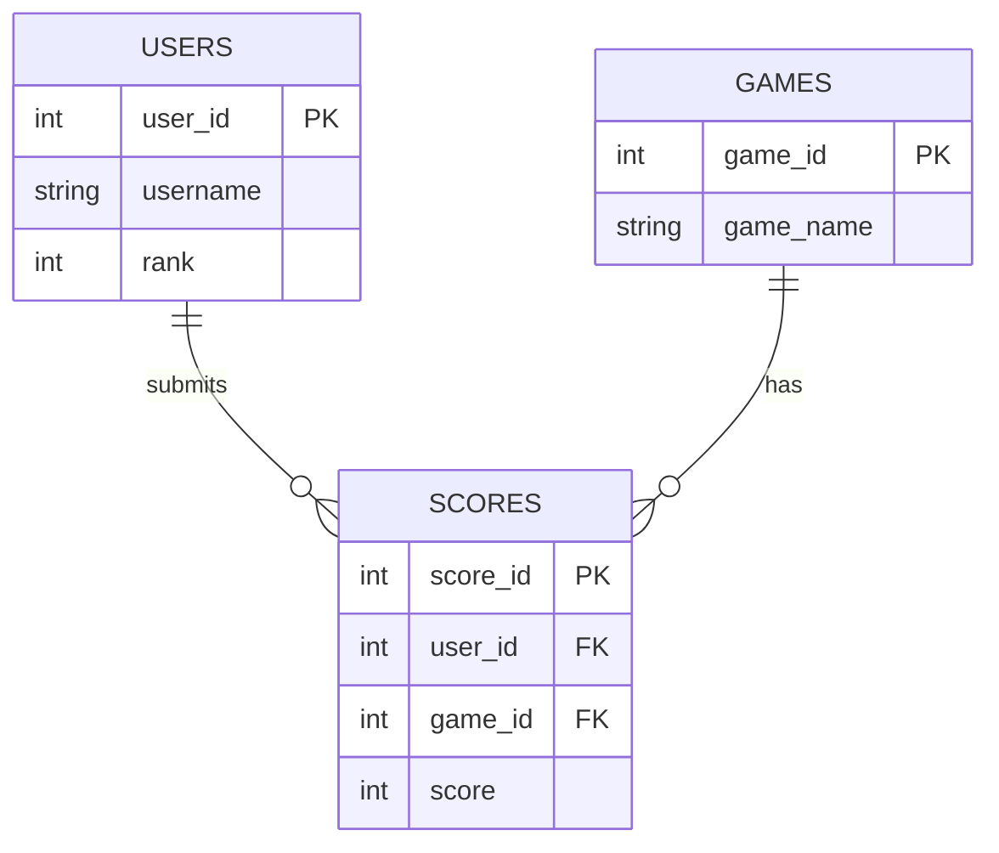

In case something happens

# App Description 

The Leaderboard Tracker application that we've developed allows users to submit their score for a game, track the  scores, and compare rankings with other players. 

# Feature List

### Must Have features:

1. Game selection - Allows a user who enters the website to choose from a pre-defined list of games before submitting their score
2. Score submission - A User will enter their score for the game that they have chosen.
3. User Rankings - Score are ranked from highest - lowest  based on the game chosen.
4. Our Leaderboard a relatively simple yet defined table showing the score, name, and rank of a user.

## Should have features

## Nice To have Features

## 

# Database structure  

This is a representation of our projects assets as it enters the database 

## User Stories 

A user, a player would want to see the top-ranked users for a certain game in order to compare scores.

Another user could submit a score after a game so that they could track their own progression and improvement.

A developer could use an API endpoint in order to use leaderboard data so that they could integrate it with other applications.

