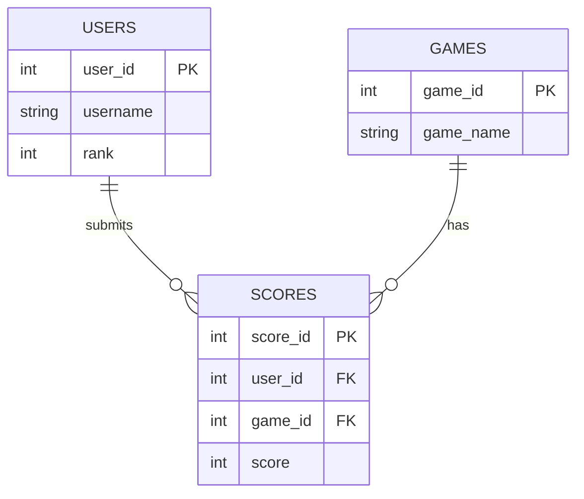
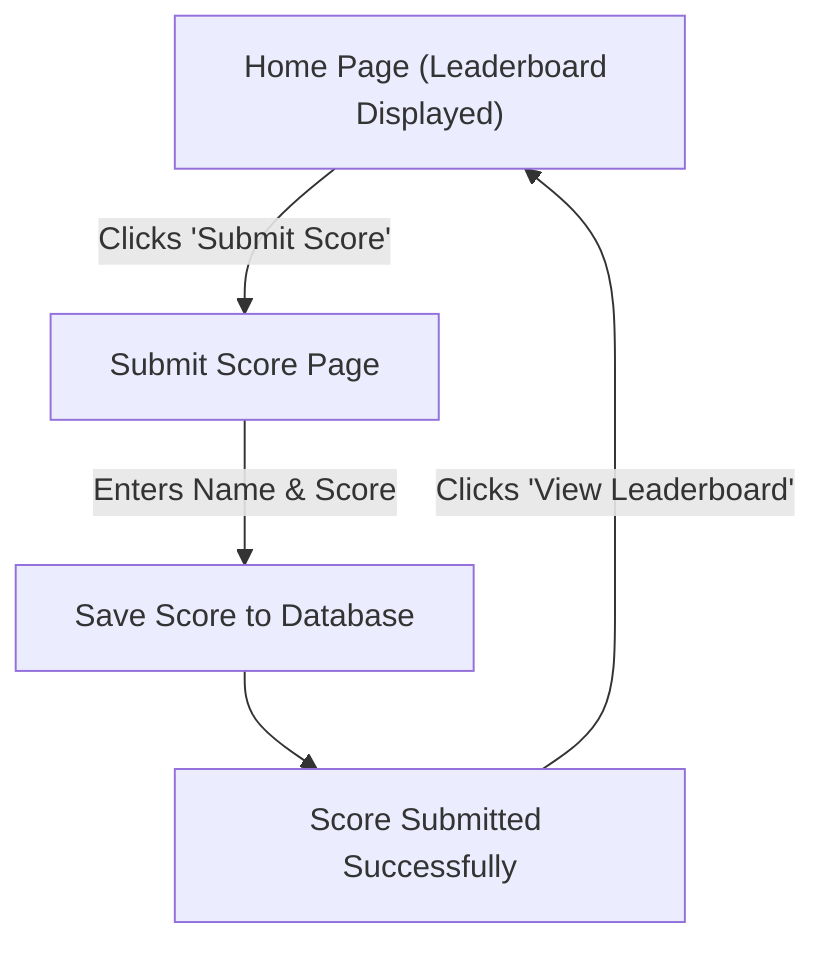

# App Description 

The Leaderboard Tracker application that we've developed allows users to submit their score for a game, track the  scores, and compare rankings with other players. 

# Feature List

## Must Have features:

1. Game selection - Allows a user who enters the website to choose from a pre-defined list of games before submitting their score.
2. Score submission - A User will enter their score for the game that they have chosen.
3. User Rankings - Score are ranked from highest - lowest  based on the game chosen.
4. Our Leaderboard a relatively simple yet defined table showing the score, name, and rank of a user.

## Should have features

1. Basic CSS Styling - The app has simple but visually structured UI.
2. Success Message - Displays a message confirming the score was submitted.
3. API Endpoint - Returns leaderboard data in JSON format. 

## Nice To have Features

1. Delete Score (Admin Only) - Admins can remove incorrect scoes.
2. Filter/Search Scores - Users can search for their name in the leaderboard. 
3. Top 3 Highlighted - Visually highlight the top 3 scores.  

# User Stories 

1. As a player, I want to see my rank and score on the leaderboard after submitting it, so I know how I compare to others.
2. As a player, I want to submit my score after a game so that I can track my progression and improvement.
3. As a developer, I want to use an API endpoint to access leaderboard data so that I can integrate it with other applications.

# Database structure  

This is a representation of our projects assets as it enters the database 

# User Flow Diagram

# List of Endpoints

| Endpoint             | Method | Description                                        | Authentication Required |
|----------------------|--------|----------------------------------------------------|------------------------|
| `/`                  | GET    | Display the leaderboard (homepage)                 | No                     |
| `/submit`            | GET    | Show the score submission form                     | No                     |
| `/submit`            | POST   | Submit a score to the leaderboard                   | No                     |
| `/api/leaderboard`   | GET    | Return leaderboard data as JSON                    | No                     |
| `/update-score`    | GET    | Show the form to update an existing score         | No                     |
| `/update-score`    | POST   | Update an existing score in the database          | No                     |

