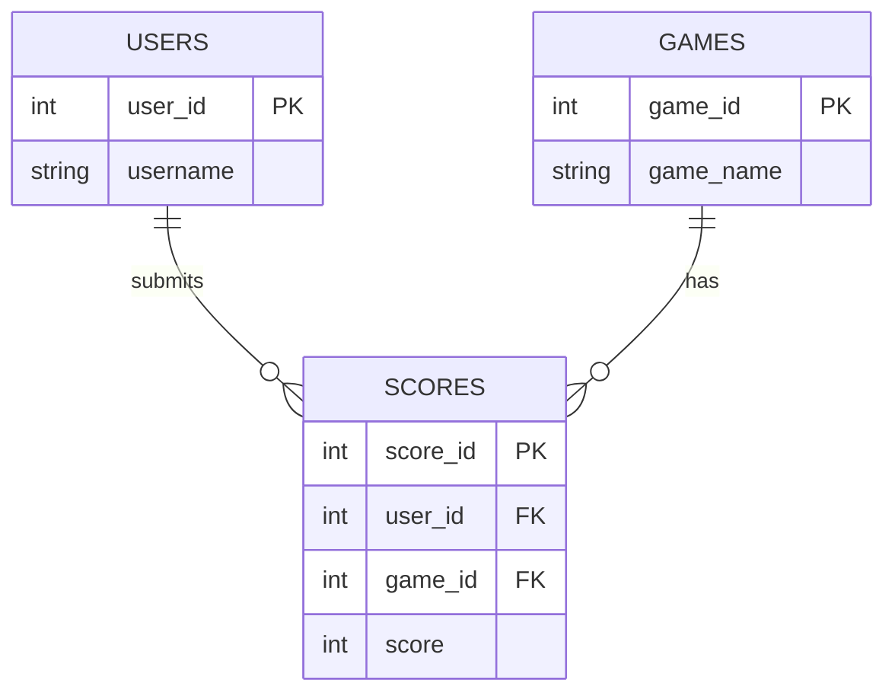
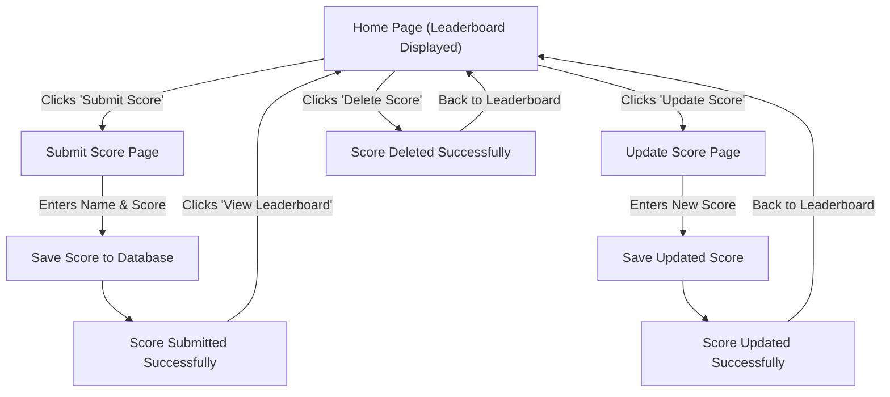

# App Description 

The Leaderboard Tracker application that we've developed allows users to submit their score for a game, track the  scores, and compare rankings with other players. 

# Planning Process  

## Cannon washington - Front-end Development
## Aastha Mahajan - Back-end Development
## John Richardson - Database - Back-end Development

# Task Assignments

### John Richardson developed the test suite and implemented analytical tools such as Bandit, Mypy, and Flake8 to perform both static and dynamic analysis. He also enhanced the scoreboard functionality by introducing a numerical rank display for each player listed.

### Cannon Washington set-up the "Issues" in Github and used the analytical tool built into PyCharm, "Qodana" to perform static analysis. 

### Aastha Mahajan implemented the search bar feature so users can search for names on the leaderboard, added a favicon to the web app, created the Kanban board using Trello with tasks and future backlog items, and updated the README with clear instructions and updated screenshots.

# Feature List

## Must Have features:

1. Game selection - Allows a user who enters the website to choose from a pre-defined list of games before submitting their score.
2. Score submission - A User will enter their score for the game that they have chosen.
3. Sort the scores from highest-lowest
4. Our Leaderboard a relatively simple yet defined table showing the score, name, and allowing CRUD functionality.
5. Search by Name feature, allows the users to filter the leaderboard by username. 

## Should have features

1. Basic CSS Styling - The app has simple but visually structured UI.
2. Success Message - Displays a message confirming the score was submitted.
3. API Endpoint - Returns leaderboard data in JSON format. 

## Nice To have Features

1. Delete Score (Admin Only) - Admins can remove incorrect scoes.
2. Filter/Search Scores - Users can search for their name in the leaderboard. 
3. Top 3 Highlighted - Visually highlight the top 3 scores.  

## New Features

1. Search Bar - Allows user to search for specific users
2. CSS Additions - Favicon
3. Rank postion display

# User Stories 

1. As a player, I want to see my rank and score on the leaderboard after submitting it, so I know how I compare to others.
2. As a player, I want to submit my score after a game so that I can track my progression and improvement.
3. As a developer, I want to use an API endpoint to access leaderboard data so that I can integrate it with other applications.

# Analysis tools

## Static Analysis 

Flake8 was used to check python code, programming errors, and complex constructs. 

mypy performed type-checking to ensure safety in function calls and DB interactions

## Dynamic Analysis

bandit was used to scan for security vulnerabilities in the live code. 

# Test Coverage

# Database structure  

This is a representation of our projects assets as it enters the database 

# User Flow Diagram

## API Endpoints

| Endpoint | Method | Description | Authentication Required |
|----------|--------|-------------|--------------------------|
| `/` | GET | Display the leaderboard with optional game selection and search by username | No |
| `/submit` | GET | Show the score submission form | No |
| `/submit` | POST | Submit a new score to the leaderboard | No |
| `/api/leaderboard` | GET | Return leaderboard data as JSON (for a selected game) | No |
| `/api/leaderboard/<game>/<score_id>` | POST | Delete a specific score from the leaderboard | No |
| `/update-score/<game>/<score_id>` | GET | Show the form to update an existing score | No |
| `/update-score/<game>/<score_id>` | POST | Update an existing score in the database | No |
